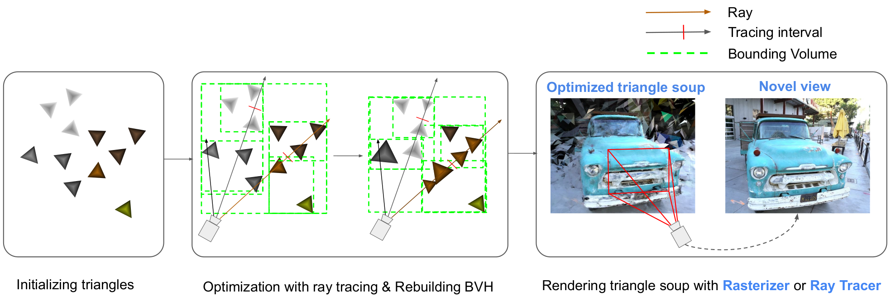
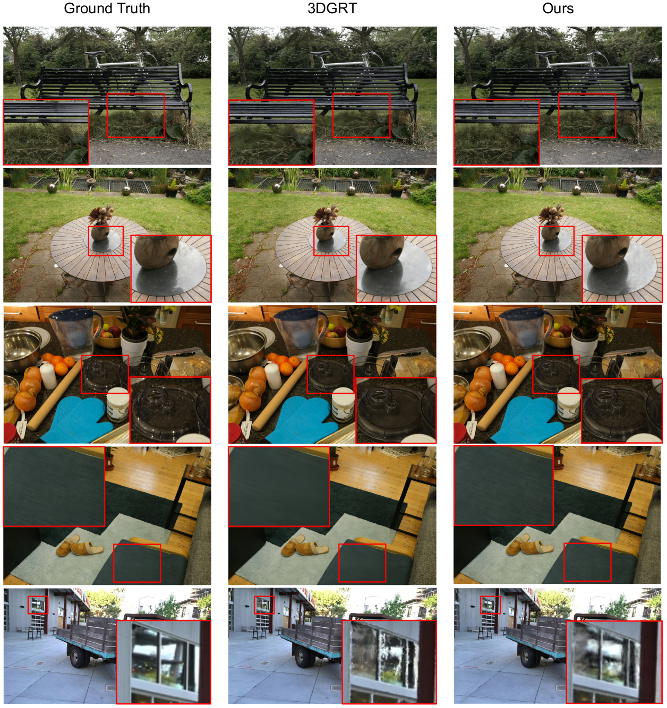
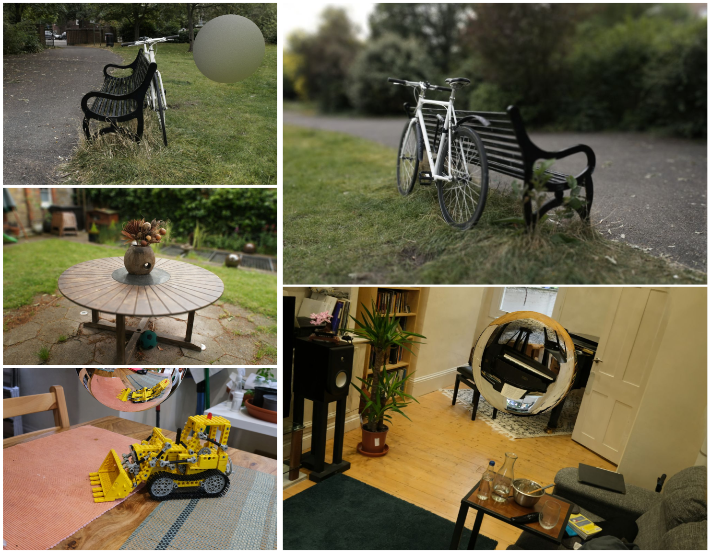

<h1 align="center">UTrice</h1>

<div align="center">
  <a href="https://www.google.com">Paper</a>
</div>
<br>

<br>

<div align="center">
  
</div>

<br>

This repository is the official implementations of UTrice: Unifying Primitives in Differentiable Ray Tracing and Rasterization via Triangles for Particle-Based 3D Scenes.

We propose a differentiable triangle-based ray tracing pipeline that treats triangles as primitives without proxy geometry, achieving higher rendering quality while maintaining real-time performance. It also directly renders triangles optimized by Triangle Splatting, unifying the primitives used in novel-view-synthesis.

<br>

<div align="center">
  
</div>


## Requirements

- This project has been built and tested on Ubuntu 22.04 with Python 3.11 and CUDA 12.6.
- To reproduce our results, we recommend a GPU with 24GB VRAM and Ray Tracing (RT) Cores. We tested on an RTX 4500 Ada and RTX 6000 Ada.

## Installation

Clone this repository with submodules: 

```bash
git clone --recursive https://github.com/waizui/UTrice.git
cd UTrice
```

We use Conda to manage the environments. Please install Conda in advance, then execute the following commands to create and activate an environment.

```bash
conda env create -f environment.yaml
conda activate utrice
```

Then install these two modules to finish the installation. 

```bash
pip install submodules/simple-knn --no-build-isolation
pip install submodules/diff-triangle-tracer --no-build-isolation
```

## Training

To train our model, use the following command:
```bash
python train.py -s <path_to_scenes> -m <output_model_path> --eval
```

Add **--outdoor** to train on outdoor scenes:
```bash
python train.py -s <path_to_scenes> -m <output_model_path> --outdoor --eval
```

## Rendering
To render a scene, use:
```bash
python render.py -m <path_to_model>
```

## Evaluation
To evaluate the model, use:
```bash
python metrics.py -m <path_to_model>
```

## Reproduce our results
We provide a convinent script to reproduce the results of our paper, to run this scripts, please
put all scenes inside a sibiling directory of this project and rename it to **datasets**. It should look like:
```bash
<parent>/
 ├─ datasets/
 │   ├─ bicycle/
 │   ├─ garden/
 │   └─ ...
 └─ <UTrice>/
```
Then, run following command:

```bash
python eval_all.py
```

The results will be saved in the **UTrice/output** directory.

## Datasets
The MipNeRF360 scenes are hosted by the paper authors [here](https://jonbarron.info/mipnerf360/). You can find SfM datasets for Tanks&Temples and Deep Blending [here](https://repo-sam.inria.fr/fungraph/3d-gaussian-splatting/datasets/input/tandt_db.zip).

## Render Effects
We provide examples of ray tracing effects using --render_mode: dof, reflect, refract, envlight. 
```bash
python render.py -m <path_to_model> --render_mode <render_mode>
```

<div align="center">
  
</div>
